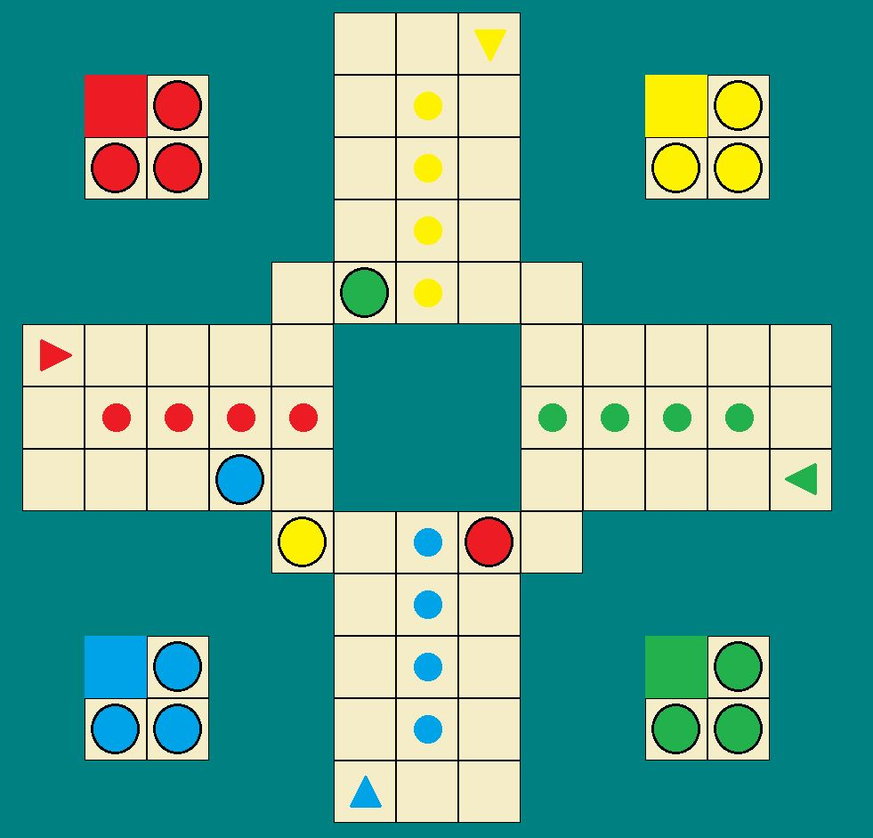

# ludo - Board game simulation made with Qt.

Repo presents single game proceeded by computer. Concept is based on common rules of traditional <b>ludo</b> like:
* maximum <b>1</b> pawn of each colour can be on playboard at particular moment,
* game will last until any player has all pawns on finish fields,
* player must roll <b>6</b> in order to introduce next pawn,
* when <b>2</b> pawns meet on the same field after the end of turn, staying pawn is automatically sent to its start field.

